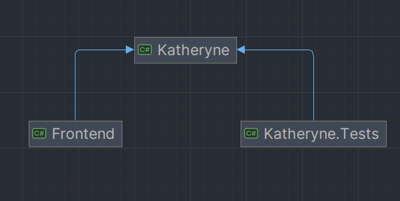

# 基于领域特定语言的客服机器人设计与实现

## 需求分析

项目要求实现一个面向客服机器人领域的领域特定语言（DSL）解释器。

其中**领域特定语言**是一种相对简单的文法，用于在特定领域的业务流程定制。在本次项目实现中，要求定义一个描述在线客服机器人自动应答逻辑的领域特定语言，即：

- 支持根据用户不同的输入返回不同的输出
- 调用指定的接口获得信息返回给用户
- 从用户输入的文本中提取信息进行返回

## 领域特定语言文法说明

基于上述对于领域特定语言的要求，设计如下的领域特定文法。

文法中的核心是定义**状态**，每个状态对应了机器人的一句输出，在每个状态中定义了**迁移关系**，通过**正则表达式**匹配用户的输入来迁移到不同的状态。因此该文法的定义的机器人是用户输入驱动的，只有当用户进行输入时机器人才会给出对应的输出。

领域特定文法采用类似于`YAML`语言的语法进行定义。

文法文本拥有三个顶级属性：

- `robotName` 字符串类型，规定了机器人的名称；
- `stages` Stage类型的数组，规定了机器人的各个阶段；
- `beginStageName` 字符串类型，规定了机器人初始阶段，会自动输出该阶段的输出内容。

Stage类型拥有三个属性：

- `name` 阶段的名称，是阶段**唯一的标识符**；
- `transformers` Transformer类型的数组，指定该阶段的迁移规则；
- `answer` 该阶段的输出内容。

Transformer类型拥有两个属性：

- `pattern` 匹配用户输入的正则表达式；
- `nextStageName` 匹配成功之后需要迁移到的阶段名。

参照下面的例子：

```yaml
robotName: 移动客服
stages:
  - name: run
  	answer: 欢迎致电中国移动10086客服热线
  	transfomrers:
  	  - pattern: .*?
  	    nextStageName: run
beginStageName: run
```

在上述的文法中定义了一个最简单的客服机器人，这个机器人的名称为“移动客服”，机器人有且只有一个状态`run`，就是输出“欢迎致电中国移动10086客服热线”，而且`.*?`的正则表达式在表示不论用户输入任何内容的文本，机器人都会再次迁移到`run`状态而继续输出“欢迎致电中国移动10086客服热线”。机器人在启动时也处于`run`状态，因此在首次运行时，机器人也会输出“欢迎致电中国移动10086客服热线”。

在`Tranform`类型的`pattern`属性支持一种特殊的空匹配模式，即当`pattern`属性留空时，机器人会在不等待用户输入的情况下直接迁移到下一个状态，扩展了文法的表现力。

在`Stage`类型的`answer`属性中支持两种特殊的扩展语法：

- 利用上文中设置的迁移正则表达式中提取用户的输入作为输出的一部分，使用`$number` 作为标识符指定提取到的信息应当插入在何处，`number`是匹配成功的列表索引。
  例如，使用正则表达式`(.*?)`迁移到拥有如下 `answer: 感谢冒险家完成了“$1”, 这是你的奖励。`属性的阶段， 会将用户的输入完全替换到`$1`所在的位置。当用户输入“攀高危险”文本时，机器人就会输出“感谢冒险家完成了‘攀高危险’，这是你的奖励”。

- 调用系统中预先定义的API作为回答，使用`@module/method`调用。
  例如：利用`@weather/text`调用weather模块的text方法获得当前北京的天气信息。对于`answer: 今天北京的天气是@wether/text`的阶段来说，假定当前模块返回的北京天气为“晴”，机器人的输出就会是“今天北京的天气是晴”。

  当前程序中提供的API模块有：

  - Weather:
    text: 获得当前天气文本
    temp: 获得当前温度

为了保证用户输入的文法正确性，在编译用户输入的文法时会进行按照进行下面列出的检查：

- `transformers` 中的 `nextStageName`指定的阶段是否定义；
- `beginStageName` 指定的阶段是否定义。
- 调用的模块和方法是否存在。

## 项目框架简介

### 核心解释器

项目中核心解释器使用[.NET](https://dotnet.microsoft.com/zh-cn/)平台的[C#](https://learn.microsoft.com/zh-cn/dotnet/csharp/)语言进行实现。

.NET是一个免费的，跨平台的开源开发人员平台，可以使用多种语言、编辑器和库连构建Web，移动、桌面、游戏等应用。C#语言是一种简单、现代、面向对象和类型安全的编程语言。

### 人机接口界面

项目中的人机接口界面采用基于[ASP.NET](https://learn.microsoft.com/zh-cn/aspnet/core/?view=aspnetcore-8.0)中的[Blazor](https://learn.microsoft.com/zh-cn/aspnet/core/blazor/?view=aspnetcore-8.0)技术开发的网页界面提供。

Blazor是一种.NET前端框架，在单个编程模型中同时支持服务器端呈现和客户端交互性。

## 程序模块划分和接口设计

### 程序模块划分

程序在整体上分为三个模块，通过解决方案中的三个不同项目表现：

- 核心接口设计和解释器实现：`Katheryne`项目
- 解释器的测试：`Katheryne.Tests`项目
- 人机接口界面实现：`Frontene`项目

其中后面两个项目依赖第一个项目。



### 程序接口设计

为了是解释器实现和测试、人机接口分离，在`Katheryne.Abstractions`命名空间中定义了对话机器人的抽象接口，也即脚本语言解释器对外提供的功能。

> 在C#语言中，命名空间和文件夹相对应，因此命名空间`Katheryne.Abstractions`就在`Katheryne`项目的`Abstractions`文件夹下实现。

#### 聊天机器人接口

聊天机器人接口是对同用户对话的机器人的抽象，在接口中定义了：

- 聊天机器人名称
- 机器人在启动时输出的对话
- 机器人在结束对话时输出的对话
- 机器人在获得特定用户输入时输出的对话

#### 聊天机器人工厂接口

按照工厂模式的设计原则，设计聊天机器人工厂，通过设置文法来“生产”按照指定的文法运行的机器人。

聊天机器人工厂接口定义了：

- 获得当前使用的语法文本
- 设置机器人需要使用的文法
- 创造按照当前文法运行的机器人，即实现了上述聊天机器人接口的对象

#### 模块接口

鉴于在文法中提供了通过模块名称和参数名称调用模块的方法，制定模块接口以提供文法设计者提供新的模块之功能。

模块接口定义了：

- 获得模块的名称
- 判断模块是否提供指定的参数
- 获得指定参数对应的结果

## 解释器核心数据结构和实现细节

解释器中的核心数据结构是语法树`GrammarTree`。在语法树中的核心数据结构是以阶段名为键，阶段对象为值的哈希表。当通过转换关系获得下一个阶段的名称，从哈希表中可以快速获得下一个阶段对象并格式化输出。

在进行格式化输出时，需要进行两个格式化操作：

- 从用户的输入匹配的正则表达式中提取信息
- 调用模块获得信息。

因此，设计`StringFormatter`类支持上述两个操作。在构建`StringFormatter`类的同时检查文法中调用的模块及其参数是否存在，并将文法中需要从用户的输入中提取信息的序号和标签保存在列表中，需要调用模块中获得信息的模块名、参数名和标签也保存在列表中。在进行格式化操作时直接遍历列表进行格式化操作，提高各司花的效率。

在机器人运行过程中可能由于错误的脚本设计或者错误的用户输入而导致运行时异常。例如：

- 在脚本中利用空转移语法错误的编写了死循环
- 在脚本中提取用户输入时指定的序号导致数组越界

机器人程序会自动捕获这些异常并封装抛出一个统一的错误`GrammarException`，方便外部接口进行进一步的错误处理。

## 测试

采用`XUnit`作为测试框架编写测试样例。

在`Katheryne.Tests`项目中设计两种测试样例：

- 针对项目中某一部分代码进行的单元测试
- 指定文法和输入输出对解释器进行测试的集成测试

同时基于自建的`Gitea Actions`系统设置了在每次`git`推送提交之后自动运行测试的系统。


### 单元测试

在程序中设计了如下单元测试：

1. 词法分析测试。

   通过给出脚本，判断程序是否能够正确将解析脚本中的各种元素。

2. 输出格式化测试。

   鉴于在语法设计过程中设计了大量输出的扩展语法，输出部分代码逻辑较为复杂，故单独设计测试模块。

   故针对从用户输入提取信息和调用内部模块两种扩展语法设置单元测试，判断程序能够正确格式化输出和是否判断文法中对模块的调用合法。

3. 模块测试

   为了保证程序中提供的模块工作正常，对程序中提供的每一个模块单独编写测试用例。

### 集成测试

通过编写DSL脚本文件`grammar.yaml`、机器人的输入文件`in.txt`和机器人的输出文件`out.txt`。程序自动构造使用该脚本文件的机器人，从输入文件中读取内容作为机器人的输入，将机器人的输出同输出文件做比较，进行机器人的整体集成测试。测试也分成正常测试和异常测试两种，正常测试判断机器人是否正常进行工作，异常测试判断机器人能否在异常脚本/异常输入中正确抛出异常。

### 测试覆盖率

使用工具获得单元测试的覆盖率为：


## 结论和心得

在本次大作业中设计了一门面向客服机器人领域的领域特定脚本语言并实现了该领域特定脚本语言的解释器。

通过这次大作业，我实践了在《程序设计实践》课程上学习到的各种程序设计实践方式，尝试从软件开发的完整过程审视程序设计中需要注意的各种问题，力图写出运行正确，可读性稿，设计优雅的跨平台高性能程序。同时在编写程序中的过程中尝试各种现代工具辅助程序的开发，例如结合流行的`DevOps`概念在`Git`平台上部署`CI/CD`流程，使用`docker`作为程序的分发平台。

在完成这次大作业之后，我认识到了在程序设计过程中需要注意的各种问题，从顶层的程序接口设计到底层每句代码的编写和注释的编写，通过各种代码设计规范和编写工具的辅助，可以更高效的编写简介而高性能的代码。同时，各种单元测试和集成测试的编写也辅助我发现了程序中存在的各种问题，表明了测试的重要性。